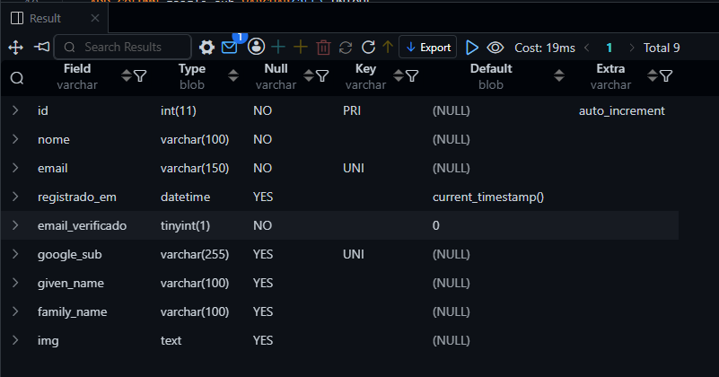

# Atividade: Preparando o banco para o login com Google

## Conteúdo do arquivo `r.txt`

```text
1. Pesquise
    1.1 Quais informações do usuário o Google envia para o sistema quando a pessoa faz login? 

    - sub: identificador único da conta Google
    - email: e-mail do usuário
    - email_verified: informa se o e-mail foi verificado pelo Google
    - name: nome completo
    - given_name: primeiro nome
    - family_name: sobrenome
    - picture: URL da foto de perfil
    - hd: pode aparecer em contas Google Workspace e indicar o domínio da organização

    Além disso, o token possui campos técnicos:

    - iss: quem emitiu o token
    - aud: para qual Client ID o token foi criado
    - iat: momento em que o token foi emitido
    - exp: momento em que o token expira
    - azp: cliente autorizado
    - jti: identificador do token, quando presente
    - auth_time: momento da autenticação, em alguns casos
    - amr: métodos usados na autenticação, quando solicitado

    2.1 Qual desses campos identifica a pessoa de forma única no Google e nunca muda?

    O sub é o campo que identifica a pessoa de forma única e nunca muda, é indicado utilizar o sub como identificador da conta no banco.

2. Relacione
    1.2 Tabela
    Campo que o Google envia - O que significa - Já existe no banco? - Precisa criar coluna? Qual?

    sub - identificador único da conta Google -  Não - Sim, google_sub
    email - e-mail do usuário - Sim - Não
    email_verified - informa se o e-amil foi verificado pelo Google - Não - Sim, email_verificado 
    name - nome completo - Sim - Não
    given_name - primeiro nome - Não - Sim, given_name
    family_name - sobrenome - Não - Sim, family_name
    picture - URL da foto de perfil - Não - Sim, img

3. Pense e responda
    1.3 Um usuário que entra pelo Google tem senha no nosso sistema? O que isso muda na coluna senha?
        Não, que a coluna "senha" é desnecessária.

    2.3 Por que não usar apenas o e-mail para identificar o usuário do Google?
        O e-mail não é o tipo mais estavel para identificação, além de não ser o recomendado pelo próprio Google e existir o "sub" como identificador único.

    3.3 A coluna que guarda o identificador do Google pode ter valores repetidos? Que restrição ela precisa ter?
        Não, a coluna precisa ter a restrição "UNIQUE" na criação da tabela.

    4.3 Como o sistema pode saber se uma conta foi criada pelo formulário ou pelo Google?
        Essa informação pode ser filtrada e enviada pelo Front-end, mas o back-end pode tentar filtrar pelas informações que forem recebidas, se existir "sub" a conta foi criada pelo Google. O back-end pode filtrar também sabendo de onde veio a informação, se veio de um caminho da api feita especifica para contas criadas pelo Google e outra para contas criadas pelo formulário.

    5.3 A Maria já tem cadastro com e-mail e senha. Um dia ela clica em "Entrar com Google" com o mesmo e-mail. O sistema deve criar uma conta nova ou usar a mesma? Por quê?
        Depende. As duas opções são possíveis. Porém, se uma conta nova for criada, ela só poderá fazer login via Google. Ao meu ver, usar a mesma conta seria a melhor opção entre as duas, mas o mais ideal seria impedir a criação de uma conta com o mesmo e-mail, informando que ja existe uma conta cadastrada e redirecionando para a tela de login.

    6.3 Todas as informações que o Google envia precisam ser guardadas no banco? Dê exemplos do que não precisa e explique por quê.
        Não. Nem todas as informações enviadas pelo Google precisam ser guardadas no banco de dados. Por exemplo, o "picture" que contém a URL da foto de perfil do usuário, não é necessário para realizar logins futuros, já que ele não é utilizado para identificar o usuário.

4. Adapte o banco
    1.4 Escreva o script SQL para adaptar a tabela usuarios.
        Regra: o banco já tem usuários cadastrados, então não pode usar DROP TABLE nem recriar a tabela. Use ALTER TABLE.
        Depois de rodar o script, execute DESCRIBE usuarios; e tire um print do resultado.

        ALTER TABLE usuarios
            DROP COLUMN senha,

            ADD COLUMN email_verificado BOOLEAN NOT NULL DEFAULT FALSE,
            ADD COLUMN google_sub VARCHAR(255) UNIQUE,
            ADD COLUMN given_name VARCHAR(100),
            ADD COLUMN family_name VARCHAR(100),
            ADD COLUMN img TEXT;

            DESCRIBE usuarios;
```

## Banco de dados utilizado

O banco original e as alterações realizadas estão no arquivo `db.sql`.

```sql
DROP DATABASE atividade;

CREATE DATABASE atividade;

use atividade;

CREATE TABLE usuarios (
    id INT AUTO_INCREMENT PRIMARY KEY,
    nome VARCHAR(100) NOT NULL,
    email VARCHAR(100) NOT NULL UNIQUE,
    senha VARCHAR(255) NOT NULL,
    role ENUM('admin', 'usuario') NOT NULL DEFAULT 'usuario',
    criado_em TIMESTAMP DEFAULT CURRENT_TIMESTAMP
);

-- Parte 4: Adpte o banco
ALTER TABLE usuarios
    DROP COLUMN senha,

    ADD COLUMN email_verificado BOOLEAN NOT NULL DEFAULT FALSE,
    ADD COLUMN google_sub VARCHAR(255) UNIQUE,
    ADD COLUMN given_name VARCHAR(100),
    ADD COLUMN family_name VARCHAR(100),
    ADD COLUMN img TEXT;

DESCRIBE usuarios;
```

